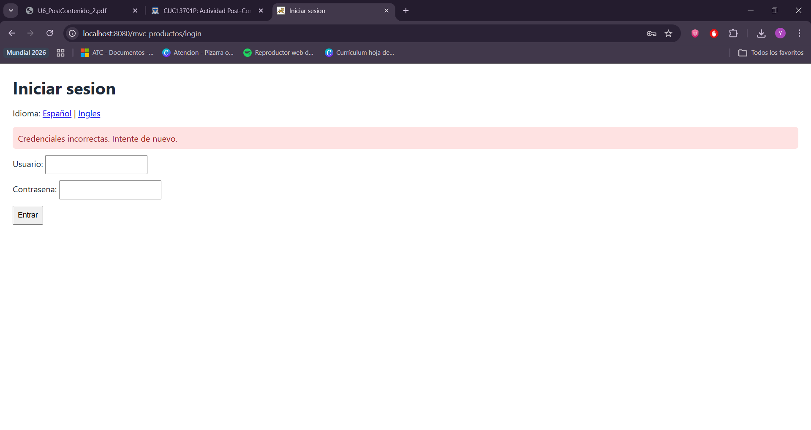
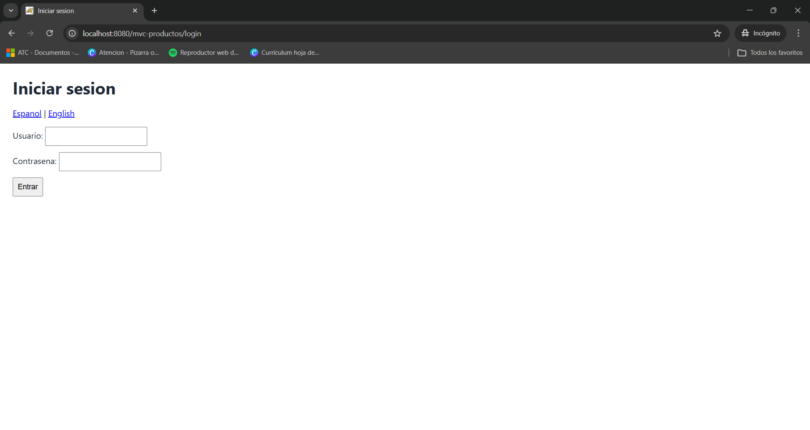
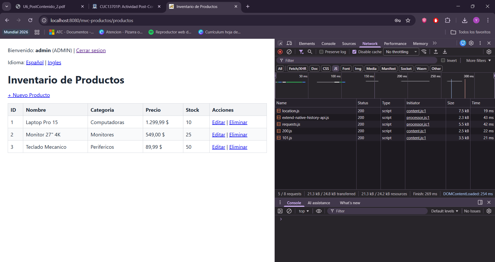

# mvc-productos

Aplicación Java Web con patrón MVC para gestionar productos con autenticación por sesión, validaciones del lado del servidor e internacionalización (i18n).

## Descripción

El proyecto implementa un CRUD de productos sobre Servlet + JSP + JSTL, con separación clara de responsabilidades:

- El Servlet recibe la petición y delega la lógica al servicio.
- El servicio valida reglas de negocio y usa el DAO para persistencia en memoria.
- Las JSP renderizan la interfaz usando EL/JSTL, sin scriptlets.
- El acceso a las rutas de productos está protegido por sesión.
- Las acciones de escritura se restringen al rol `ADMIN`.

## Prerrequisitos

- Java 25 o compatible con el Tomcat instalado en esta máquina.
- Apache Tomcat 11.
- Maven 3.9 o superior.
- Navegador web moderno.

## Ejecución local

1. Compilar el proyecto:

```bash
mvn clean package
```

2. Copiar el WAR generado a `webapps` del Tomcat local:

```bash
copy target\mvc-productos.war C:\Users\Yeremy Silva\Tomcat11\apache-tomcat-11.0.21\webapps\mvc-productos.war
```

3. Iniciar Tomcat en consola:

```bash
C:\Users\Yeremy Silva\Tomcat11\apache-tomcat-11.0.21\bin\catalina.bat run
```

4. Abrir la aplicación:

- Aplicación: http://localhost:8080/mvc-productos/
- Login: http://localhost:8080/mvc-productos/login

## Credenciales de prueba

- Usuario: `admin`
- Contraseña: `Admin123!`

- Usuario: `viewer`
- Contraseña: `View456!`

## Funcionalidades implementadas

- Login con `HttpSession`.
- Logout con invalidación de sesión.
- Protección de rutas del CRUD si no hay sesión activa.
- Restricción de escritura para el rol `ADMIN`.
- Listado, creación, edición y eliminación de productos.
- Validación del lado del servidor para nombre, precio y stock.
- Retroalimentación de errores por campo en el formulario.
- Repoblado del formulario cuando hay errores.
- Internacionalización con selector de idioma persistido en sesión.

## Capturas

Se conservaron solo las capturas que tienen evidencia directa de los checkpoints verificados.

### Login con credenciales incorrectas

Muestra el mensaje de error en la misma página.



### Acceso sin sesión

La aplicación redirige al login cuando se intenta entrar sin sesión activa.



### Inicio de sesión correcto

La lista muestra el usuario autenticado en el encabezado mediante `${sessionScope.usuarioActual.username}`.



## Checkpoints omitidos

No se incluyó captura para el cambio de idioma en la tabla ni para la validación servidor-vista del formulario porque no quedaron evidencias visuales específicas para esos checkpoints.

## Historial de commits

La evolución del trabajo quedó registrada en commits descriptivos:

- `chore(init): initial commit`
- `feat(auth): add session login, role checks, validations and i18n`
- `feat(i18n): add locale selector and server-side form feedback`
- `docs(readme): add rubric-aligned project documentation`

## Estructura relevante

- `src/main/java/` código fuente Java.
- `src/main/webapp/WEB-INF/views/` vistas JSP.
- `src/main/resources/` bundles de internacionalización.
- `capturas/` evidencia visual seleccionada.